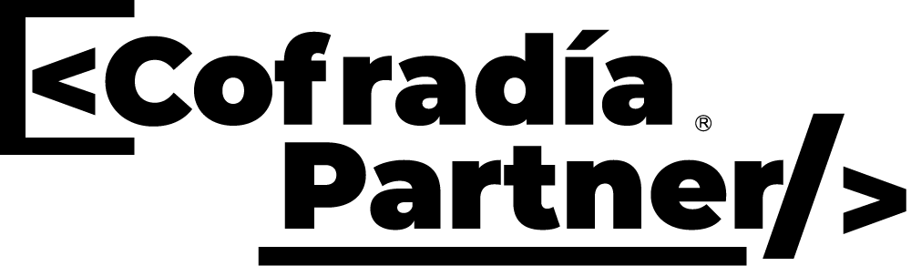

# @cofradiapartner/skills

<p align="center">
  
</p>

<p align="center">
  CLI para instalar skills reutilizables con un destino local unificado en <code>.agents/skills</code>.
</p>

<p align="center">
  
  
  
  
  
</p>

## Instalacion

| Uso con pnpm | Uso con npm |
| --- | --- |
| `pnpm dlx @cofradiapartner/skills` | `npx @cofradiapartner/skills` |
| `pnpm add -g @cofradiapartner/skills` | `npm install -g @cofradiapartner/skills` |
| Luego ejecuta `create-skill` | Luego ejecuta `create-skill` |

## Comandos Disponibles

```bash
create-skill
create-skill list
create-skill search <query>
create-skill validate <skillId>
create-skill validate --all
create-skill doctor
create-skill install <skillId...> [--target <path>] [--global] [--dry-run] [--yes] [--all]
create-skill create <skillName>
create-skill remove <skillId> [--target <path>] [--global] [--dry-run] [--yes]
create-skill update <skillId> [--target <path>] [--global] [--dry-run]
```

## Configuracion Del CLI

| Rutas por defecto | Reglas operativas |
| --- | --- |
| Proyecto local: `.agents/skills` | La instalacion local siempre converge en `.agents/skills` salvo que se use `--target`. |
| Instalacion global: `~/.agents/skills` | `--global` mueve la operacion a `~/.agents/skills`. |
| Precedencia: `--target` -> `--global` -> `.agents/skills` | `--target` tiene prioridad total sobre `--global` y sobre la ruta local por defecto. |
|  | `remove` y `update` resuelven el mismo destino que `install`. |
|  | `sourceSkillsDir` nunca debe tratarse como carpeta destino editable. |

### `sourceSkillsDir` vs `targetSkillsDir`

| Concepto | Significado |
| --- | --- |
| `sourceSkillsDir` | Carpeta interna del paquete con las skills fuente (`skills/` dentro del paquete). |
| `targetSkillsDir` | Carpeta destino dentro del proyecto del usuario donde se instalan las skills. |

Las operaciones destructivas (`remove`, `update`) tienen guardas para no tocar `sourceSkillsDir`.

## Ejemplos Rapidos

### Flujo interactivo

```bash
pnpm dlx @cofradiapartner/skills
```

El flujo interactivo pregunta si quieres instalar la skill en el entorno global o dentro de la ruta actual donde ejecutas el comando. Si eliges la ruta actual, luego puedes usar la ruta consolidada `.agents/skills` o indicar un destino custom.

El modo interactivo es persistente: al terminar una accion (listar, buscar, validar, instalar, doctor), el CLI vuelve al menu principal para que puedas seguir operando sin relanzar el comando.

La navegacion usa opciones explicitas de `Volver` en cada subflujo. `Esc` no forma parte del contrato oficial de navegacion. Para salir de forma inmediata en cualquier momento, usa `Ctrl+C`.

En la opcion `Buscar skills`, si hay coincidencias puedes seleccionar una skill encontrada y continuar con el flujo normal de instalacion. En la seleccion multiple de skills para instalar, usa `[espacio] para seleccionar`.

### Operaciones comunes

| Accion | Comando |
| --- | --- |
| Listar skills | `pnpm dlx @cofradiapartner/skills list` |
| Buscar skills | `pnpm dlx @cofradiapartner/skills search apple` |
| Instalar una skill | `pnpm dlx @cofradiapartner/skills install skill-apple-ui` |
| Instalar varias | `pnpm dlx @cofradiapartner/skills install skill-apple-ui skill-brand-ui` |
| Instalar todas | `pnpm dlx @cofradiapartner/skills install --all` |
| Usar target custom | `pnpm dlx @cofradiapartner/skills install skill-apple-ui --target docs/ai-skills` |
| Instalar global | `pnpm dlx @cofradiapartner/skills install skill-apple-ui --global` |
| Dry run | `pnpm dlx @cofradiapartner/skills install skill-apple-ui --dry-run` |
| Validar una skill | `pnpm dlx @cofradiapartner/skills validate skill-apple-ui` |
| Validar todas | `pnpm dlx @cofradiapartner/skills validate --all` |
| Ejecutar doctor | `pnpm dlx @cofradiapartner/skills doctor` |
| Crear scaffold | `pnpm dlx @cofradiapartner/skills create skill-demo` |
| Eliminar skill | `pnpm dlx @cofradiapartner/skills remove skill-apple-ui` |
| Actualizar skill | `pnpm dlx @cofradiapartner/skills update skill-apple-ui` |
| Actualizar global | `pnpm dlx @cofradiapartner/skills update skill-apple-ui --global` |
| Eliminar global | `pnpm dlx @cofradiapartner/skills remove skill-apple-ui --global` |

## Protecciones Importantes

- `install --all` no acepta IDs posicionales.
- `validate --all` no acepta ID posicional.
- `install` sin IDs y sin `--all` falla.
- `remove` y `update` rechazan targets dentro de `sourceSkillsDir`.
- `--dry-run` no modifica archivos.

## Desarrollo Local

### Recomendado con pnpm

```bash
pnpm install
pnpm run typecheck
pnpm run lint
pnpm run test
pnpm run test:coverage
pnpm run build
```

### Alternativa equivalente con npm

```bash
npm install
npm run typecheck
npm run lint
npm run test
npm run test:coverage
npm run build
```

## Publicacion En npm

Flujo manual de publicacion del paquete:

```bash
pnpm run changeset
pnpm run version-packages
pnpm run build
npm publish --access public
```

## Skills Incluidas

- `skill-apple-ui`

## Documentacion Interna

- `docs/cli-operating-rules.md`
